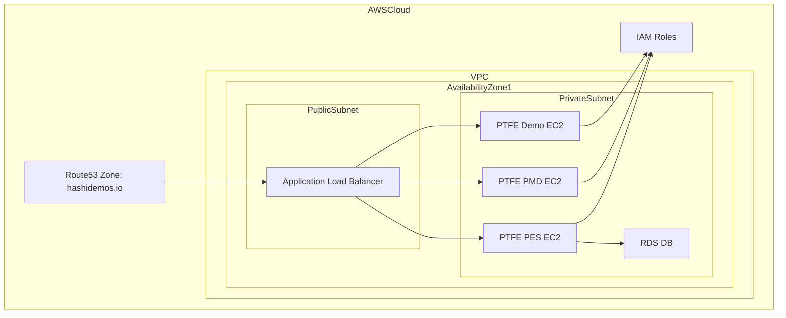

# architecture-beta

```mermaid
graph TD
  subgraph AWSCloud
    subgraph VPC
      subgraph AvailabilityZone1
        subgraph PublicSubnet
          ALB[Application Load Balancer]
        end
        subgraph PrivateSubnet
          Demo[PTFE Demo EC2]
          PMD[PTFE PMD EC2]
          PES[PTFE PES EC2]
          RDS[RDS DB]
        end
        ALB --> Demo
        ALB --> PMD
        ALB --> PES
        PES --> RDS
      end
    end
    Route53[Route53 Zone: hashidemos.io]
    Route53 --> ALB
    IAM[IAM Roles]
    Demo --> IAM
    PMD --> IAM
    PES --> IAM
  end

%% Nota explicativa
%% Esta arquitetura utiliza AWS VPC com sub-redes públicas e privadas, onde um Application Load Balancer (ALB) direciona o tráfego para instâncias EC2 que executam diferentes modos do Terraform Enterprise (Demo, PMD, PES). O Route53 gerencia o DNS para o domínio hashidemos.io, enquanto o RDS provê o banco de dados para a solução. O controle de acesso é realizado por IAM Roles, garantindo segurança e segregação de permissões entre os componentes.
```
